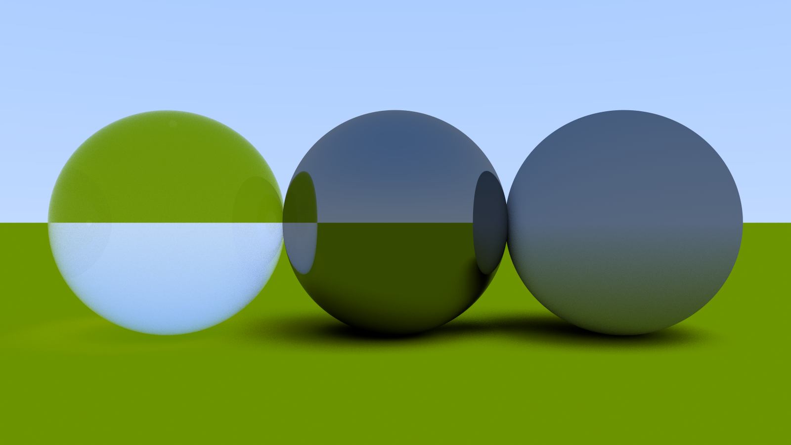

# HighPerf RayTracer

A physically-based ray tracer written from scratch in C++, with no external rendering libraries. Built for correctness first, performance second — every system is hand-rolled, from the math primitives up to BVH acceleration.

---

## Current Render

> 1600×900 — 150 samples per pixel — 50 max bounces — BVH-accelerated, tile-based multithreaded



Three spheres on an infinite plane: a diffuse Lambertian on the right, a perfect mirror metal in the center, and a glass dielectric on the left — rendered with a blue-white sky gradient background, now traced through a BVH and split across a thread pool instead of one scanline at a time.

<details>
<summary>Previous renders</summary>

#### Materials & Anti-Aliasing — 2026-06-09


First render with all three material types (Lambertian, metal, dielectric) and multi-sample anti-aliasing, before BVH or multithreading existed.

</details>

---

## Performance

Same scene, same 1600×900 / 150 samples-per-pixel / 50-bounce settings, same machine, same compiler flags (`-O2`) — the only thing that changed is the rendering approach:

| Version | Render time |
|---|---|
| Linear object scan, single-threaded (pre-BVH) | 19m 17.8s |
| BVH + tile-based multithreading (current) | 5m 41.5s |

**~3.4x faster** — about a 70.5% cut in render time.

---

## Architecture

The renderer is structured around a clean virtual `Hittable` interface. Every object in the scene exposes two methods — `hit()` for ray intersection and `boundingBox()` for BVH traversal — making it trivial to add new primitives.

```
src/
├── main.h            — Vec3, Ray, Color, PPM output, RNG
├── main.cpp          — camera, render loop, scene setup
├── hittable.h        — Hittable base class + HitRecord
├── hittable_list.h   — scene container + surroundingBox()
├── aabb.h            — axis-aligned bounding box (slab method)
├── bvh.h             — BVH node (construction + traversal)
├── sphere.h          — sphere primitive
├── plane.h           — infinite plane primitive
├── material.h        — Material base class
├── lambertian.h      — diffuse Lambertian scattering
├── metal.h           — specular reflection with fuzz
└── dielectric.h      — glass refraction (Snell's law + Schlick)
```

---

## What's Implemented

### Core
- **Vec3 / Ray / Color** — hand-rolled math with dot product, normalization, arithmetic operators
- **PPM output** — renders directly to `.ppm` image files
- **Recursive ray tracing** — up to N bounces with configurable depth
- **Anti-aliasing** — multi-sample per pixel with random jitter

### Primitives
- **Sphere** — analytic ray-sphere intersection
- **Infinite Plane** — ray-plane intersection with a configurable normal

### Materials
- **Lambertian** — diffuse scattering with random hemisphere sampling
- **Metal** — specular reflection with a fuzz parameter for roughness
- **Dielectric** — full refraction via Snell's law in vector form, total internal reflection, and Schlick's approximation for Fresnel reflectance

### Acceleration
- **AABB** — axis-aligned bounding box with slab-method ray intersection
- **BVH** — `BVHNode` recursively splits objects along a random axis at each node, sorted by bounding-box center, down to leaf nodes; `hit()` culls whole subtrees via the node's box before recursing — ray intersection drops from **O(n)** to **O(log n)**

### Performance
- **Tile-based multithreading** — the image is split into 32×32 tiles pulled from a shared atomic counter, so worker threads (`std::thread::hardware_concurrency()` of them) grab the next tile as soon as they finish one instead of owning a fixed range up front — keeps threads busy even when some tiles (like the mirror/glass spheres) take far longer than others
- **Live progress bar** — single-line, carriage-return-driven bar + fraction showing tiles completed

---

## Roadmap

### Short Term
- [x] Complete BVH constructor and `hit()` traversal
- [ ] Gamma correction (currently linear output)
- [ ] Moveable / configurable camera (FOV, look-at, aperture)
- [ ] Depth of field / defocus blur

### Materials & Lighting
- [ ] Emissive materials (area lights)
- [ ] Texture mapping (UV coordinates, image textures, procedural noise)
- [ ] Physically correct BRDF (microfacet model)

### Primitives
- [ ] Triangle mesh support (OBJ loading)
- [ ] Axis-aligned boxes
- [ ] Motion blur (time-sampled rays)

### Performance
- [x] Multithreading (std::thread tile-based rendering)
- [ ] SIMD vectorization for AABB and Vec3 operations
- [ ] BVH SAH (Surface Area Heuristic) for optimal tree splits
- [ ] Progressive rendering with live preview

### Long Term
- [ ] GPU port (CUDA or Vulkan compute)
- [ ] Spectral rendering (wavelength-based instead of RGB)
- [ ] Volumetric rendering (participating media, fog, subsurface scattering)
- [ ] Full path tracer with multiple importance sampling (MIS)

---

## Building

Requires a C++17 compiler and CMake.

```bash
cmake -S . -B cmake-build-debug
cmake --build cmake-build-debug
./cmake-build-debug/HighPerf-RayTracer
```

Output is written to `src/image.ppm`. Open with any PPM viewer or convert with ImageMagick:

```bash
magick src/image.ppm output.png
```

---

## References

- [_Ray Tracing in One Weekend_](https://raytracing.github.io/books/RayTracingInOneWeekend.html) — Peter Shirley
- [_Physically Based Rendering_](https://pbr-book.org) — Pharr, Jakob, Humphreys
- Schlick, C. (1994). *An Inexpensive BRDF Model for Physically-based Rendering*
